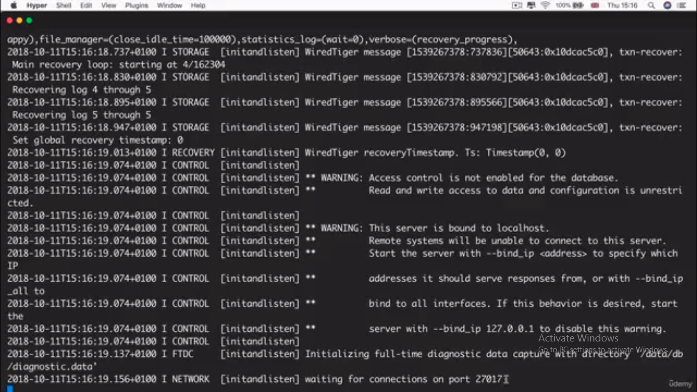

# MongoDB

This guide will help you walkthrough the basics of Mongo DB and how to perform CRUD operations in it.

## 1. Installation
[Click here](https://blog.londonappbrewery.com/how-to-download-install-mongodb-on-mac-2895ccd2b5c1?_ga=2.263162187.69246892.1663777432-1288310609.1662196991&gi=dc20c95a89ce) to view the installation on MAC

[Click here](https://medium.com/@LondonAppBrewery/how-to-download-install-mongodb-on-windows-4ee4b3493514) to view the installation on Windows


## 2. Launch the MongoDB server
1. By now you must have installed MongoDB now its time to test our database.
First test your installation by typing below command in your terminal
```bash
$ mongo --version
```
If you see something like below then you have successfully installed MongoDB on your system.


2. Now in terminal/cmd/powershell window, type 
```bash
$ mongod
```
3. This will initiate a server, more like localhost we use in express.
Now if you see something like this with with a propmt saying waiting for connection on port portnumber(look at the botton in image) 

then you have started the server now it's time to start working with our database
## 3. Working with MongoDB
 Open a new terminal session and type 
```bash
$ mongo
```
and you will enter the mongo shell. Now, if you type 
```bash
$ help 
``` 
this will display the list of commands you can use in the mongo shell
### 1. Show database
If we type 
```mongo
$ show dbs
```
this will display all the existing databases in our sysetm.

### 2. Use databse
```bash
$ use database-name
# Ex: use fruitsDb

# To delete a database, switch to the database using use dbname and then type
$ db.dropDatabase()
# Ex:
# > use fruitsDb
# > db.dropDatabase()
```
this will help you enter the database if exists or it will create one

### 3. Create collection/table
In order to create a collection you must enter a single record thus creation and insertion is done together
```bash
$ db.collections.insertOne({field: value, field:value})
# Ex: db.shop.insertOne({_id: 1, name: "Pen", price: 1.20})
```
here collections is going to be your table name

### 4. CRUD in MongoDB
- ### (CREATE) 
To read all records, similar to select * from table
```bash
$ db.collection.find()
# Ex: db.shop.find()
```
- To find specific records, similar to select * from table where = condition
```bash
$ db.collection.find({field: value})
# Ex: db.shop.find({name: "Pen"})
```

- ### (READ)
To get a specific column
```bash
$ db.collection.find({field: value},{field:1 or 0})
# 1 means display the col 0 means don't 

# Ex: db.shop.find({name: "Pen"}, {name: 1})
# this will only display name id and name column
# Note: id col comes by default, set 0 incase we don't want it
```

- ### (UPDATE)
To update a record
```bash
$ db.collection.updateOne({field: value},{$set {field: new value}})
# Ex: db.shop.updateOne({_id: 1},{$set: {price: 2}})
```

- ### (DELETE)
To delete a record
```bash
$ db.collection.remove({field: value})
                 or
$ db.collection.deleteOne({field: value})
# Ex: db.shop.remove({name:"Pen"})
```

## 4. Relations in MongoDB
Realtions in mongo db are created in the form of embedded documents for example:

```bash

db.shop.insert(
    {
        _id: 5,
        name: "Page",
        price: 0.50,
        stock: 100, 
        reviews: [
            {
                author: "Nick",
                rating: 5,
                reivew: "Very clean and neat"
            },
            {
                author: "Mike",
                rating: 4,
                reivew: "Amazing quality"
            }
        ]
    }
)
```

Here we are embedding a list of two documents in our review field

## 5. Connection with MongoDB using Node
- Install the native mongodb driver using
    ```bash
    $ npm i mongodb
    ```

- Now, in your app.js import the driver and write the below code

```javascript
const MongoClient = require("mongodb").MongoClient;
const assert = require("assert");

// Connection URL
const url = "mongodb://localhost:27017";

// Database name
const dbName = "fruitsDB";

// Create a new MongoClient
const client = new MongoClient(url, {useNewUrlParser: true});

// Use connect method to connect to the server
client.connect(function(err){
    assert.equal(null,err);
    console.log("Connected to Databsae Successfully!");
    
    const db = client.db(dbName);
    client.close();
});
```
- Here the dbname is our database name to which we are going to connect, if the database does not exists it will create one.


## 6. Inserting into database using Node
- To insert new records paste the following code below the connection code
```javascript
const insertDocuments = function (db, callback) {
    // get the documents collection
    const collection = db.collection("fruits");
    // Inserting new documents
    collection.insertMany([
        {
            _id: 1,
            name: "Apple",
            price: 5,
            qty: 100
        },
        {
            _id: 2,
            name: "Banana",
            price: 3,
            qty: 50
        }
    ], function (err, result) {
        console.log("Records inserted successsfully");
        callback(result);
    });
};
```
- Here we are inserting 2 rows using the insertMany function
- Then we replace the client.close() code with the following
```javascript
insertDocuments(db, function () {
        client.close();
});
 ```

 ## 7.  Reading from database using Node
 - Reading is similar to inserting we use db.collection.find() query to read the records
 - Follow along the below code in your app.js

 ```javascript
 const findDocuments = function (db, callback) {
    // which collection to read from
    const collection = db.collection('fruits');
    // read some documents
    collection.find({}).toArray(function (err, result) {
        console.log(result);
        callback(result);
    });
};
 ```
 - and call the client.close(); from the findDocuments();
 ```javascript
 findDocuments(db,function(){
     client.close();
 });
 ```

 Now, as we can see there's a lot of code we are doing which is kind bit of a pain for us if we want to build an application quickly.

 Now, we will discuss the industry standards to work with Mongo which is very popular among the developers.

<!-- ---------------------------------------------------------- -->
<!--                Starting Mongoose section                   -->
<!-- ---------------------------------------------------------- -->
 ---
 # Mongoose 
 1. Install the mongoose package using
 ```bash
 $ npm i mongoose
 ```
 and import it into the project

 ```javascript
const mongoose = require("mongoose");

// pass the url to the connect function
// fruitsDB is our db name replace it with the db name which you want to connect with
mongoose.connect("mongodb://localhost:27017/fruitsDB", { useNewUrlParser: true });

console.log("Connected!!");
 ```
 