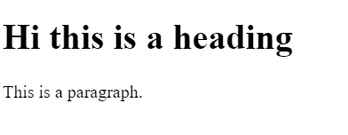
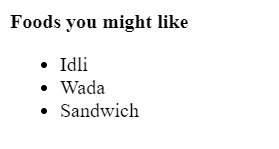
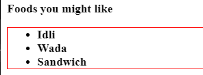

# React Notes

Initially start practising on [CodeSandBox.io](https://codesandbox.io/) by creating a new react app.

## 1. Getting started
### 1. Basic App
```javascript
// Import the following to get started
import React from "react";
import ReactDOM from "react-dom";

// Target the root element
const roolElement = document.getElementById("root");

// Prepare content
// Only one element can go in the top body, so nest everything inside a div
const content = (
  <div>
    <h1>Hi this is a heading</h1>
    <p>This is a paragraph.</p>
  </div>
);

// To render content use the ReactDOM with render() method which takes 2 params
// @param 1 - What to display (your content)
// @param 2 - Where to display (your target element)
ReactDOM.render(content, roolElement);
```

- Output

    


### 2. Using Variables
```javascript
// Import the following to get started
import React from "react";
import ReactDOM from "react-dom";

// Target the root element
const roolElement = document.getElementById("root");

// To inject a value of a variable, use {varName} 
const foodItem = "Sandwich";

// Prepare content
// Only one element can go in the top body so, nest everything inside a div
const content = (
  <div>
    <b>Foods you might like</b>
    <ul>
      <li>Idli</li>
      <li>Wada</li>
      <li>{foodItem}</li>
    </ul>
  </div>
);

// To render content use the ReactDOM with render() method which takes 2 params
// @param 1 - What to display (your content)
// @param 2 - Where to display (your target element)
ReactDOM.render(content, roolElement);

```

- Output

    


### 3. Using Custom Styles
```javascript
// Import the following to get started
import React from "react";
import ReactDOM from "react-dom";

// Target the root element
const roolElement = document.getElementById("root");

// To inject a value of a variable, use {varName}
const foodItem = "Sandwich";

// To apply custom styles using inline styling
let customStyles = {
  border: "1px solid red",
  fontWeight: "bold" // camelcase properties instead of regular css kebab case
}

// Prepare content
// Only one element can go in the top body so, nest everything inside a div
const content = (
  <div>
    <b>Foods you might like</b>
    {/* Or we can do something like below */}
    {/* <ul style = {{color: "red"}}> */}
    {/* The reason is that, it takes a JS object for styling */}
    <ul style = {customStyles}>
      <li>Idli</li>
      <li>Wada</li>
      <li>{foodItem}</li>
    </ul>
  </div>
);

// To render content use the ReactDOM with render() method which takes 2 params
// @param 1 - What to display (your content)
// @param 2 - Where to display (your target ele
ReactDOM.render(content, roolElement);
```

- Output

    


### 4. Applying what we've learnt
```javascript
// Import the following to get started
import React from "react";
import ReactDOM from "react-dom";

// Target the root element
const roolElement = document.getElementById("root");

// Get the current time in hours
let curHours = new Date().getHours();

// Declare a greeting message
let greetingMessage = "";

// Decalre default style
let customStyle = {
  color: "black"
};

// Apply logic based on current time and provide a greeting message and style
if (curHours < 12) {
  greetingMessage = "Morning";
  customStyle.color = "green";
} else if (curHours >= 12 && curHours < 17) {
  greetingMessage = "Afternoon";
  customStyle.color = "yellow";
} else if (curHours >= 17 && curHours < 21) {
  greetingMessage = "Evening";
  customStyle.color = "pink";
} else {
  greetingMessage = "Night";
  customStyle.color = "blue";
}

// Only one element can go in the top body, so nest everything inside a div
const content = (
  <div>
    <h1 style={customStyle}>Hii, it's {greetingMessage}</h1>
  </div>
);

// To render content use the ReactDOM with render() method which takes 2 params
// @param 1 - What to display (your content)
// @param 2 - Where to display (your target element)
ReactDOM.render(content, roolElement);
```

- Output

    


### 5. Exporting components

- index.js
```javascript
// Import the following to get started
import React from "react";
import ReactDOM from "react-dom";

// import the component and include it wherever you want
import Heading  from "./heading";

// Target the root element
const roolElement = document.getElementById("root");

// Only one element can go in the top body, so nest everything inside a div
const content = (
  <div>
    {/* include the component as many times you want */}
    <Heading />
  </div>
);

ReactDOM.render(content, roolElement);

```

- heading.jsx
```javascript
// Import the following to get started
import React from "react";

// Create a funtion which returns the component
function Heading() {
//  return the html
  return <h1>This is a heading component</h1>
}
// Export it as default because you're going to use this as default 
export default Heading
```

- Output

    


### 6. Understanding Import and Export keywords
- math.js
```javascript
const pi = 3.14;

function doublePi(){
  return pi * 2;
}

function triplePi(){
  return pi * 3;
}

// So when we write default export it exports the function,member,component on default basis, means whenever you import this module the default exported thing will be imported.
// There can only be one single default export
export default pi;

export {
  doublePi,
  triplePi
}
```

- index.js
```javascript
// While importing from our very own math module we are not specifying what to import so we will be getting what is being exported on the default basis, thus we end up getting the value of pi which we have stored 
import myvalue from './math'
import {doublePi, triplePi} from './math'
// or 
import * as pi from './math'

/* 

  // ------------------------------------
  // Points to remember
  // ------------------------------------
   1. The myvalue holds the value of pi in it that is getting exported from the math module
   2. you can use any name while importing a default module
   3. But in case of non-default exports, names really do matter 
   
*/
console.log(myvalue);   // 3.14
console.log(doublePi());   // 6.28

// ---------------------------------------
console.log(pi.default);   // 3.14
console.log(pi.doublePi());   // 6.28


```

