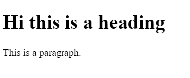

# React Notes

Initially start practising on [CodeSandBox.io](https://codesandbox.io/) by creating a new react app.

## 1. Getting started
### 1. Basic App
```javascript
// Import the following to get started
import React from "react";
import ReactDOM from "react-dom";

// Target the root element
const roolElement = document.getElementById("root");

// Prepare content
// Only one element can go in the top body, so nest everything inside a div
const content = (
  <div>
    <h1>Hi this is a heading</h1>
    <p>This is a paragraph.</p>
  </div>
);

// To render content use the ReactDOM with render() method which takes 2 params
// @param 1 - What to display (your content)
// @param 2 - Where to display (your target element)
ReactDOM.render(content, roolElement);
```

- Output

    


### 2. Using Variables
```javascript
// Import the following to get started
import React from "react";
import ReactDOM from "react-dom";

// Target the root element
const roolElement = document.getElementById("root");

// To inject a value of a variable, use {varName} 
const foodItem = "Sandwich";

// Prepare content
// Only one element can go in the top body so, nest everything inside a div
const content = (
  <div>
    <b>Foods you might like</b>
    <ul>
      <li>Idli</li>
      <li>Wada</li>
      <li>{foodItem}</li>
    </ul>
  </div>
);

// To render content use the ReactDOM with render() method which takes 2 params
// @param 1 - What to display (your content)
// @param 2 - Where to display (your target element)
ReactDOM.render(content, roolElement);

```

- Output

    


### 3. Using Custom Styles
```javascript
// Import the following to get started
import React from "react";
import ReactDOM from "react-dom";

// Target the root element
const roolElement = document.getElementById("root");

// To inject a value of a variable, use {varName}
const foodItem = "Sandwich";

// To apply custom styles using inline styling
let customStyles = {
  border: "1px solid red",
  fontWeight: "bold" // camelcase properties instead of regular css kebab case
}

// Prepare content
// Only one element can go in the top body so, nest everything inside a div
const content = (
  <div>
    <b>Foods you might like</b>
    {/* Or we can do something like below */}
    {/* <ul style = {{color: "red"}}> */}
    {/* The reason is that, it takes a JS object for styling */}
    <ul style = {customStyles}>
      <li>Idli</li>
      <li>Wada</li>
      <li>{foodItem}</li>
    </ul>
  </div>
);

// To render content use the ReactDOM with render() method which takes 2 params
// @param 1 - What to display (your content)
// @param 2 - Where to display (your target ele
ReactDOM.render(content, roolElement);


```

- Output

    


